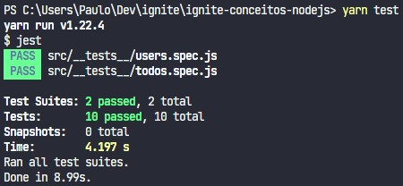
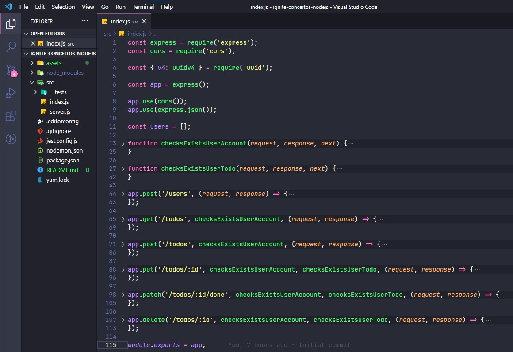
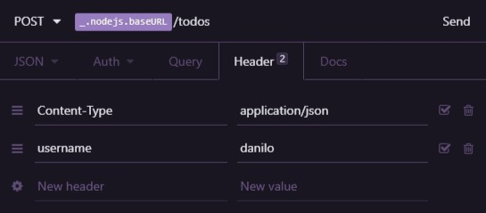

# Desafio 1 do Ignite Trilha NodeJS


<h3 align="center">
  Desafio 01: Conceitos do Node.js
</h3>

<p align="center">“Não espere para plantar, apenas tenha paciência para colher”!</blockquote>

<p align="center">
  

  <a href="https://rocketseat.com.br">
    
  </a>

  

  <a href="https://github.com/rocketseat-education/ignite-template-conceitos-do-nodejs/stargazers">
    
  </a>
</p>

<p align="center">
  <a href="#rocket-sobre-o-desafio">Sobre o desafio</a>&nbsp;&nbsp;&nbsp;|&nbsp;&nbsp;&nbsp;
  <a href="#keyboard-instalação-e-execução-do-projeto">Instalação e Execução do Projeto</a>&nbsp;&nbsp;&nbsp;|&nbsp;&nbsp;&nbsp;
  <a href="#template-da-aplicação">Template da aplicação</a>&nbsp;&nbsp;&nbsp;|&nbsp;&nbsp;&nbsp;
  <a href="#rotas-da-aplicação-instruções">Rotas da aplicação</a>&nbsp;&nbsp;&nbsp;|&nbsp;&nbsp;&nbsp;
  <a href="#especificação-dos-testes-instruções">Específicação dos testes</a>&nbsp;&nbsp;&nbsp;|&nbsp;&nbsp;&nbsp;
  <a href="#memo-licença">Licença</a>
</p>

## :rocket: Sobre o desafio

Nesse desafio, foi criada uma aplicação backend para treinar o que aprendi até agora no Node.js!

É uma aplicação para gerenciar tarefas (em inglês *todos*). Será permitida a criação de um usuário com `name` e `username`, bem como fazer o CRUD de *todos*:

- Criar um novo *todo*;
- Listar todos os *todos*;
- Alterar o `title` e `deadline` de um *todo* existente;
- Marcar um *todo* como feito;
- Excluir um *todo*;

Tudo isso para cada usuário em específico (o `username` será passado pelo header).

### :keyboard: Instalação e Execução do Projeto

- Clone este repositório

```
> git clone https://github.com/prenato84/ignite-conceitos-nodejs
```

- Navegue até o diretório principal do projeto

```
> cd ignite-conceitos-nodejs
```

- Instale as dependências com o Yarn

```
yarn
```

- Rode a suite de testes

```
yarn test
```

- Execute o projeto

```
yarn dev
```

<p align="center">
  
</p>

### Template da aplicação

Foi utilizado um modelo de template que possui o esqueleto do projeto.

O template pode ser encontrado na seguinte url: **[Acessar Template](https://github.com/rocketseat-education/ignite-template-conceitos-do-nodejs)**

**Dica**: Caso não saiba utilizar repositórios do Github como template, utilize o guia em **[nosso FAQ](https://www.notion.so/ddd8fcdf2339436a816a0d9e45767664).**

Agora navegue até a pasta criada e abra no Visual Studio Code, lembre-se de executar o comando `yarn` no seu terminal para instalar todas as dependências, e você terá algo parecido com isso:

<p align="center">
  
</p>

### Rotas da aplicação (Instruções)

Documentação no Notion sobre as rotas e testes: **[Documentação API e Testes](https://www.notion.so/Desafio-01-Conceitos-do-Node-js-59ccb235aecd43a6a06bf09a24e7ede8)**

Com o template já clonado e o arquivo `index.js` aberto, você deve completar onde não possui código com o código para atingir os objetivos de cada teste.

#### POST `/users`

A rota deve receber `name`, e `username` dentro do corpo da requisição. Ao cadastrar um novo usuário, ele deve ser armazenado dentro de um objeto no seguinte formato:  

```jsx
{ 
	id: 'uuid', // precisa ser um uuid
	name: 'Lucas de mello', 
	username: 'lucasmello', 
	todos: []
}
```

Certifique-se que o ID seja um UUID, e de sempre iniciar a lista `todos` como um array vazio.

#### GET `/todos`

A rota deve receber, pelo header da requisição, uma propriedade `username` contendo o username do usuário e retornar uma lista com todas as tarefas desse usuário.

#### POST `/todos`

A rota deve receber `title` e `deadline` dentro do corpo da requisição e, uma propriedade `username` contendo o username do usuário dentro do header da requisição. Ao criar um novo *todo*, ele deve ser armazenada dentro da lista `todos` do usuário que está criando essa tarefa. Cada tarefa deverá estar no seguinte formato:  . Certifique-se que o ID seja um UUID.

```jsx
{ 
	id: 'uuid', // precisa ser um uuid
	title: 'Nome da tarefa',
	done: false, 
	deadline: '2021-02-27T00:00:00.000Z', 
	created_at: '2021-02-22T00:00:00.000Z'
}
```

**Observação**: Lembre-se de iniciar a propriedade `done` sempre como `false` ao criar um *todo*.

**Dica**: Ao fazer a requisição com o Insomnia ou Postman, preencha a data de `deadline` com o formato `ANO-MÊS-DIA` e ao salvar a tarefa pela rota, faça da seguinte forma: 

```jsx
{ 
	id: 'uuid', // precisa ser um uuid
	title: 'Nome da tarefa',
	done: false, 
	deadline: new Date(deadline), 
	created_at: new Date()
}
```

Usar `new Date(deadline)` irá realizar a transformação da string "ANO-MÊS-DIA" (por exemplo "2021-02-25") para uma data válida do JavaScript.

#### PUT `/todos/:id`

A rota deve receber, pelo header da requisição, uma propriedade `username` contendo o username do usuário e receber as propriedades `title` e `deadline` dentro do corpo. É preciso alterar **apenas** o `title` e o `deadline` da tarefa que possua o `id` igual ao `id` presente nos parâmetros da rota.

#### PATCH `/todos/:id/done`

A rota deve receber, pelo header da requisição, uma propriedade `username` contendo o username do usuário e alterar a propriedade `done` para `true` no *todo* que possuir um `id` igual ao `id` presente nos parâmetros da rota.

#### DELETE `/todos/:id`

A rota deve receber, pelo header da requisição, uma propriedade `username` contendo o username do usuário e excluir o *todo* que possuir um `id` igual ao `id` presente nos parâmetros da rota.

### Especificação dos testes (Instruções)

Em cada teste, tem uma breve descrição no que sua aplicação deve cumprir para que o teste passe.

Caso você tenha dúvidas quanto ao que são os testes, e como interpretá-los, dê uma olhada em **[nosso FAQ](https://www.notion.so/FAQ-Desafios-ddd8fcdf2339436a816a0d9e45767664)**

Para esse desafio, temos os seguintes testes:

#### Testes de usuários

- **Should be able to create a new user**

Para que esse teste passe, você deve permitir que um usuário seja criado e retorne um json com o usuário criado. Você pode ver o formato de um usuário [aqui](https://www.notion.so/Desafio-01-Conceitos-do-Node-js-59ccb235aecd43a6a06bf09a24e7ede8). 

Também é necessário que você retorne a resposta com o código `201`.

- **Should not be able to create a new user when username already exists**

Para que esse teste passe, antes de criar um usuário você deve validar se outro usuário com o mesmo `username` já existe. Caso exista, retorne uma resposta com status `400` e um json no seguinte formato:

```jsx
{
	error: 'Mensagem do erro'
}
```

A mensagem pode ser de sua escolha, desde que a propriedade seja `error`.

#### Testes de *todos*

**Middleware**

Para completar todos os testes referentes à *todos* é necessário antes ter completado o código que falta no middleware `checkExistsUserAccount`. Para isso, você deve pegar o `username` do usuário no header da requisição, verificar se esse usuário existe e então colocar esse usuário dentro da `request` antes de chamar a função `next`. Caso o usuário não seja encontrado, você deve retornar uma resposta contendo status `404` e um json no seguinte formato:

```jsx
{
	error: 'Mensagem do erro'
}
```

**Observação:** O username deve ser enviado pelo header em uma propriedade chamada `username`:



- **Should be able to list all user's todos**

Para que esse teste passe, na rota GET `/todos` é necessário pegar o usuário que foi repassado para o `request` no middleware `checkExistsUserAccount` e então retornar a lista `todos` que está no objeto do usuário conforme foi criado para satisfazer o [primeiro teste](https://www.notion.so/Desafio-01-Conceitos-do-Node-js-59ccb235aecd43a6a06bf09a24e7ede8).

- **Should be able to create a new todo**

Para que esse teste passe, na rota POST `/todos` é necessário pegar o usuário que foi repassado para o `request` no middleware `checkExistsUserAccount`, pegar também o `title` e o `deadline` do corpo da requisição e adicionar um novo *todo* na lista `todos` que está no objeto do usuário.

Lembre-se de seguir a estrutura padrão de um *todo* como mostrado [aqui](https://www.notion.so/Desafio-01-Conceitos-do-Node-js-59ccb235aecd43a6a06bf09a24e7ede8). 

- **Should be able to update a todo**

Para que esse teste passe, na rota PUT `/todos/:id` é necessário atualizar um *todo* existente, recebendo o `title` e o `deadline` pelo corpo da requisição e o `id` presente nos parâmetros da rota.

- **Should not be able to update a non existing todo**

Para que esse teste passe, você não deve permitir a atualização de um *todo* que não existe e retornar uma resposta contendo um status `404` e um json no seguinte formato: 

```jsx
{
	error: 'Mensagem do erro'
}
```

- **Should be able to mark a todo as done**

Para que esse teste passe, na rota PATCH `/todos/:id/done` você deve mudar a propriedade `done`de um *todo* de `false` para `true`, recebendo o `id` presente nos parâmetros da rota.

- **Should not be able to mark a non existing todo as done**

Para que esse teste passe, você não deve permitir a mudança da propriedade `done` de um *todo* que não existe e retornar uma resposta contendo um status `404` e um json no seguinte formato: 

```jsx
{
	error: 'Mensagem do erro'
}
```

- **Should be able to delete a todo**

Para que esse teste passe, DELETE `/todos/:id` você deve permitir que um *todo* seja excluído usando o `id` passado na rota. O retorno deve ser apenas um status `204` que representa uma resposta sem conteúdo.

- **Should not be able to delete a non existing todo**

Para que esse teste passe, você não deve permitir excluir um *todo* que não exista e retornar uma resposta contendo um status `404` e um json no seguinte formato:

```jsx
{
	error: 'Mensagem do erro'
}
```

## :memo: Licença

Esse projeto está sob a licença MIT. Veja o arquivo [LICENSE](https://github.com/git/git-scm.com/blob/master/MIT-LICENSE.txt) para mais detalhes.
